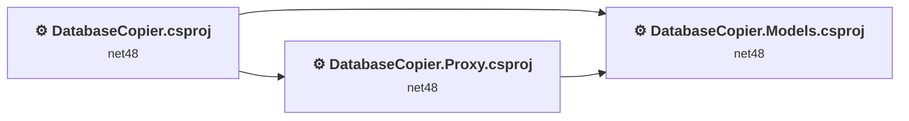
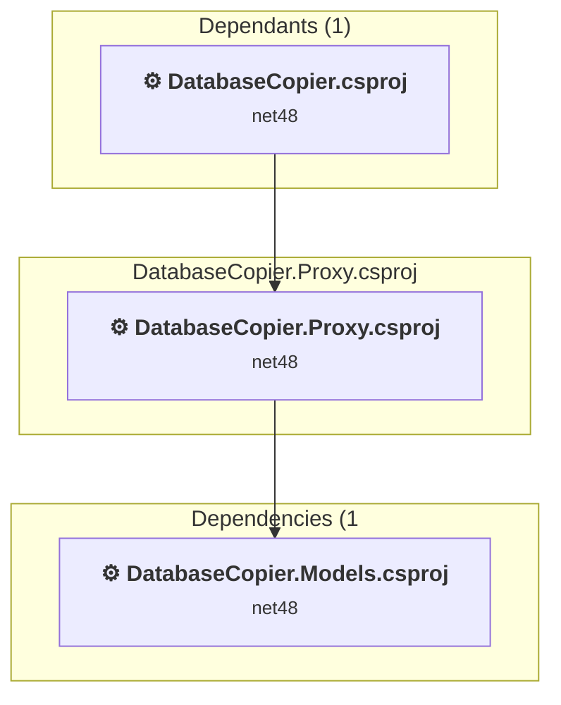
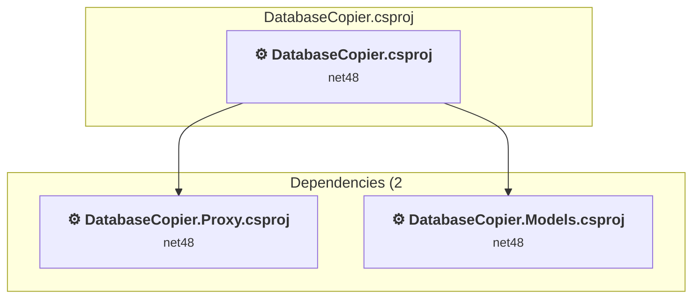
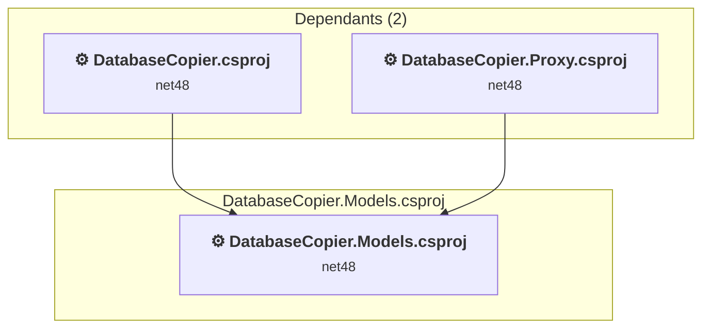

# Projects and dependencies analysis

This document provides a comprehensive overview of the projects and their dependencies in the context of upgrading to .NETCoreApp,Version=v10.0.

## Table of Contents

- [Executive Summary](#executive-Summary)
  - [Highlevel Metrics](#highlevel-metrics)
  - [Projects Compatibility](#projects-compatibility)
  - [Package Compatibility](#package-compatibility)
  - [API Compatibility](#api-compatibility)
- [Aggregate NuGet packages details](#aggregate-nuget-packages-details)
- [Top API Migration Challenges](#top-api-migration-challenges)
  - [Technologies and Features](#technologies-and-features)
  - [Most Frequent API Issues](#most-frequent-api-issues)
- [Projects Relationship Graph](#projects-relationship-graph)
- [Project Details](#project-details)

  - [C:\workspace\DatabaseCopier\DatabaseCopier.Proxy\DatabaseCopier.Proxy.csproj](#c:workspacedatabasecopierdatabasecopierproxydatabasecopierproxycsproj)
  - [DatabaseCopier.csproj](#databasecopiercsproj)
  - [DatabaseCopier.Models\DatabaseCopier.Models.csproj](#databasecopiermodelsdatabasecopiermodelscsproj)

## Executive Summary

### Highlevel Metrics

| Metric | Count | Status |
| :--- | :---: | :--- |
| Total Projects | 3 | All require upgrade |
| Total NuGet Packages | 8 | All compatible |
| Total Code Files | 18 |  |
| Total Code Files with Incidents | 13 |  |
| Total Lines of Code | 1467 |  |
| Total Number of Issues | 240 |  |
| Estimated LOC to modify | 233+ | at least 15,9% of codebase |

### Projects Compatibility

| Project | Target Framework | Difficulty | Package Issues | API Issues | Est. LOC Impact | Description |
| :--- | :---: | :---: | :---: | :---: | :---: | :--- |
| [C:\workspace\DatabaseCopier\DatabaseCopier.Proxy\DatabaseCopier.Proxy.csproj](#c:workspacedatabasecopierdatabasecopierproxydatabasecopierproxycsproj) | net48 | 🟢 Low | 0 | 183 | 183+ | ClassicClassLibrary, Sdk Style = False |
| [DatabaseCopier.csproj](#databasecopiercsproj) | net48 | 🟡 Medium | 1 | 50 | 50+ | ClassicWpf, Sdk Style = False |
| [DatabaseCopier.Models\DatabaseCopier.Models.csproj](#databasecopiermodelsdatabasecopiermodelscsproj) | net48 | 🟢 Low | 0 | 0 |  | ClassicClassLibrary, Sdk Style = False |

### Package Compatibility

| Status | Count | Percentage |
| :--- | :---: | :---: |
| ✅ Compatible | 8 | 100,0% |
| ⚠️ Incompatible | 0 | 0,0% |
| 🔄 Upgrade Recommended | 0 | 0,0% |
| ***Total NuGet Packages*** | ***8*** | ***100%*** |

### API Compatibility

| Category | Count | Impact |
| :--- | :---: | :--- |
| 🔴 Binary Incompatible | 41 | High - Require code changes |
| 🟡 Source Incompatible | 187 | Medium - Needs re-compilation and potential conflicting API error fixing |
| 🔵 Behavioral change | 5 | Low - Behavioral changes that may require testing at runtime |
| ✅ Compatible | 1260 |  |
| ***Total APIs Analyzed*** | ***1493*** |  |

## Aggregate NuGet packages details

| Package | Current Version | Suggested Version | Projects | Description |
| :--- | :---: | :---: | :--- | :--- |
| Microsoft.Bcl.AsyncInterfaces | 10.0.7 |  | [DatabaseCopier.csproj](#databasecopiercsproj) | ✅Compatible |
| Microsoft.Extensions.DependencyInjection.Abstractions | 10.0.7 |  | [DatabaseCopier.csproj](#databasecopiercsproj) | ✅Compatible |
| Newtonsoft.Json | 13.0.4 |  | [DatabaseCopier.csproj](#databasecopiercsproj) | ✅Compatible |
| Prism.Container.Abstractions | 9.0.107 |  | [DatabaseCopier.csproj](#databasecopiercsproj) | ✅Compatible |
| Prism.Core | 9.0.537 |  | [DatabaseCopier.csproj](#databasecopiercsproj) | ✅Compatible |
| Prism.Events | 9.0.537 |  | [DatabaseCopier.csproj](#databasecopiercsproj) | ✅Compatible |
| System.Runtime.CompilerServices.Unsafe | 6.1.2 |  | [DatabaseCopier.csproj](#databasecopiercsproj) | ✅Compatible |
| System.Threading.Tasks.Extensions | 4.6.3 |  | [DatabaseCopier.csproj](#databasecopiercsproj) | NuGet package functionality is included with framework reference |

## Top API Migration Challenges

### Technologies and Features

| Technology | Issues | Percentage | Migration Path |
| :--- | :---: | :---: | :--- |
| WPF (Windows Presentation Foundation) | 11 | 4,7% | WPF APIs for building Windows desktop applications with XAML-based UI that are available in .NET on Windows. WPF provides rich desktop UI capabilities with data binding and styling. Enable Windows Desktop support: Option 1 (Recommended): Target net9.0-windows; Option 2: Add <UseWindowsDesktop>true</UseWindowsDesktop>. |
| Legacy Configuration System | 2 | 0,9% | Legacy XML-based configuration system (app.config/web.config) that has been replaced by a more flexible configuration model in .NET Core. The old system was rigid and XML-based. Migrate to Microsoft.Extensions.Configuration with JSON/environment variables; use System.Configuration.ConfigurationManager NuGet package as interim bridge if needed. |

### Most Frequent API Issues

| API | Count | Percentage | Category |
| :--- | :---: | :---: | :--- |
| T:System.Data.SqlClient.SqlConnection | 18 | 7,7% | Source Incompatible |
| T:System.Data.SqlClient.SqlCommand | 12 | 5,2% | Source Incompatible |
| T:System.Windows.RoutedEventHandler | 10 | 4,3% | Binary Incompatible |
| M:System.Data.SqlClient.SqlConnection.Open | 9 | 3,9% | Source Incompatible |
| M:System.Data.SqlClient.SqlConnection.#ctor(System.String) | 9 | 3,9% | Source Incompatible |
| P:System.Data.SqlClient.SqlCommand.Connection | 8 | 3,4% | Source Incompatible |
| P:System.Data.SqlClient.SqlCommand.CommandType | 8 | 3,4% | Source Incompatible |
| P:System.Data.SqlClient.SqlCommand.CommandText | 8 | 3,4% | Source Incompatible |
| M:System.Data.SqlClient.SqlCommand.#ctor | 8 | 3,4% | Source Incompatible |
| M:System.Data.SqlClient.SqlDataReader.GetString(System.Int32) | 8 | 3,4% | Source Incompatible |
| T:System.Data.SqlClient.SqlDataReader | 7 | 3,0% | Source Incompatible |
| M:System.Data.SqlClient.SqlCommand.ExecuteReader | 7 | 3,0% | Source Incompatible |
| M:System.Data.SqlClient.SqlDataReader.Read | 6 | 2,6% | Source Incompatible |
| T:System.Data.SqlClient.SqlParameterCollection | 6 | 2,6% | Source Incompatible |
| P:System.Data.SqlClient.SqlCommand.Parameters | 6 | 2,6% | Source Incompatible |
| T:System.Data.SqlClient.SqlParameter | 6 | 2,6% | Source Incompatible |
| M:System.Data.SqlClient.SqlParameterCollection.AddWithValue(System.String,System.Object) | 6 | 2,6% | Source Incompatible |
| M:System.Data.SqlClient.SqlDataReader.GetInt32(System.Int32) | 6 | 2,6% | Source Incompatible |
| E:System.Windows.Controls.Primitives.ButtonBase.Click | 5 | 2,1% | Binary Incompatible |
| T:System.Windows.RoutedEventArgs | 5 | 2,1% | Binary Incompatible |
| M:System.Data.SqlClient.SqlCommand.ExecuteNonQuery | 4 | 1,7% | Source Incompatible |
| M:System.Data.SqlClient.SqlCommand.#ctor(System.String,System.Data.SqlClient.SqlConnection) | 4 | 1,7% | Source Incompatible |
| T:System.Data.SqlClient.SqlRowsCopiedEventHandler | 4 | 1,7% | Source Incompatible |
| T:System.Uri | 3 | 1,3% | Behavioral Change |
| P:System.Windows.FrameworkElement.DataContext | 3 | 1,3% | Binary Incompatible |
| M:System.Data.SqlClient.SqlDataReader.GetBoolean(System.Int32) | 3 | 1,3% | Source Incompatible |
| M:System.Data.SqlClient.SqlDataReader.IsDBNull(System.Int32) | 3 | 1,3% | Source Incompatible |
| M:System.Data.SqlClient.SqlDataReader.GetByte(System.Int32) | 3 | 1,3% | Source Incompatible |
| E:System.Windows.Input.CommandManager.RequerySuggested | 2 | 0,9% | Binary Incompatible |
| M:System.Uri.#ctor(System.String,System.UriKind) | 2 | 0,9% | Behavioral Change |
| T:System.Windows.Application | 2 | 0,9% | Binary Incompatible |
| M:System.Windows.Window.#ctor | 2 | 0,9% | Binary Incompatible |
| M:System.Data.SqlClient.SqlDataReader.GetInt64(System.Int32) | 2 | 0,9% | Source Incompatible |
| E:System.Data.SqlClient.SqlBulkCopy.SqlRowsCopied | 2 | 0,9% | Source Incompatible |
| M:System.Data.SqlClient.SqlDataReader.GetName(System.Int32) | 2 | 0,9% | Source Incompatible |
| T:System.Data.SqlClient.SqlBulkCopyOptions | 2 | 0,9% | Source Incompatible |
| M:System.Windows.Markup.InternalTypeHelper.#ctor | 1 | 0,4% | Binary Incompatible |
| T:System.Windows.Markup.InternalTypeHelper | 1 | 0,4% | Binary Incompatible |
| T:System.Windows.Data.IValueConverter | 1 | 0,4% | Binary Incompatible |
| M:System.Configuration.ApplicationSettingsBase.#ctor | 1 | 0,4% | Source Incompatible |
| T:System.Configuration.ApplicationSettingsBase | 1 | 0,4% | Source Incompatible |
| T:System.Windows.MessageBox | 1 | 0,4% | Binary Incompatible |
| T:System.Windows.MessageBoxResult | 1 | 0,4% | Binary Incompatible |
| M:System.Windows.MessageBox.Show(System.String) | 1 | 0,4% | Binary Incompatible |
| M:System.Windows.Application.Run | 1 | 0,4% | Binary Incompatible |
| P:System.Windows.Application.StartupUri | 1 | 0,4% | Binary Incompatible |
| M:System.Windows.Application.#ctor | 1 | 0,4% | Binary Incompatible |
| M:System.Windows.Application.LoadComponent(System.Object,System.Uri) | 1 | 0,4% | Binary Incompatible |
| T:System.Windows.Markup.IComponentConnector | 1 | 0,4% | Binary Incompatible |
| T:System.Windows.Window | 1 | 0,4% | Binary Incompatible |

## Projects Relationship Graph

Legend:
📦 SDK-style project
⚙️ Classic project

## Project Details

### C:\workspace\DatabaseCopier\DatabaseCopier.Proxy\DatabaseCopier.Proxy.csproj

#### Project Info

- **Current Target Framework:** net48
- **Proposed Target Framework:** net10.0
- **SDK-style**: False
- **Project Kind:** ClassicClassLibrary
- **Dependencies**: 1
- **Dependants**: 1
- **Number of Files**: 2
- **Number of Files with Incidents**: 2
- **Lines of Code**: 489
- **Estimated LOC to modify**: 183+ (at least 37,4% of the project)

#### Dependency Graph

Legend:
📦 SDK-style project
⚙️ Classic project

### API Compatibility

| Category | Count | Impact |
| :--- | :---: | :--- |
| 🔴 Binary Incompatible | 0 | High - Require code changes |
| 🟡 Source Incompatible | 183 | Medium - Needs re-compilation and potential conflicting API error fixing |
| 🔵 Behavioral change | 0 | Low - Behavioral changes that may require testing at runtime |
| ✅ Compatible | 224 |  |
| ***Total APIs Analyzed*** | ***407*** |  |

#### Project Package References

| Package | Type | Current Version | Suggested Version | Description |
| :--- | :---: | :---: | :---: | :--- |

### DatabaseCopier.csproj

#### Project Info

- **Current Target Framework:** net48
- **Proposed Target Framework:** net10.0-windows
- **SDK-style**: False
- **Project Kind:** ClassicWpf
- **Dependencies**: 2
- **Dependants**: 0
- **Number of Files**: 12
- **Number of Files with Incidents**: 10
- **Lines of Code**: 773
- **Estimated LOC to modify**: 50+ (at least 6,5% of the project)

#### Dependency Graph

Legend:
📦 SDK-style project
⚙️ Classic project

### API Compatibility

| Category | Count | Impact |
| :--- | :---: | :--- |
| 🔴 Binary Incompatible | 41 | High - Require code changes |
| 🟡 Source Incompatible | 4 | Medium - Needs re-compilation and potential conflicting API error fixing |
| 🔵 Behavioral change | 5 | Low - Behavioral changes that may require testing at runtime |
| ✅ Compatible | 810 |  |
| ***Total APIs Analyzed*** | ***860*** |  |

#### Project Technologies and Features

| Technology | Issues | Percentage | Migration Path |
| :--- | :---: | :---: | :--- |
| Legacy Configuration System | 2 | 4,0% | Legacy XML-based configuration system (app.config/web.config) that has been replaced by a more flexible configuration model in .NET Core. The old system was rigid and XML-based. Migrate to Microsoft.Extensions.Configuration with JSON/environment variables; use System.Configuration.ConfigurationManager NuGet package as interim bridge if needed. |
| WPF (Windows Presentation Foundation) | 11 | 22,0% | WPF APIs for building Windows desktop applications with XAML-based UI that are available in .NET on Windows. WPF provides rich desktop UI capabilities with data binding and styling. Enable Windows Desktop support: Option 1 (Recommended): Target net9.0-windows; Option 2: Add <UseWindowsDesktop>true</UseWindowsDesktop>. |

### DatabaseCopier.Models\DatabaseCopier.Models.csproj

#### Project Info

- **Current Target Framework:** net48
- **Proposed Target Framework:** net10.0
- **SDK-style**: False
- **Project Kind:** ClassicClassLibrary
- **Dependencies**: 0
- **Dependants**: 2
- **Number of Files**: 5
- **Number of Files with Incidents**: 1
- **Lines of Code**: 205
- **Estimated LOC to modify**: 0+ (at least 0,0% of the project)

#### Dependency Graph

Legend:
📦 SDK-style project
⚙️ Classic project

### API Compatibility

| Category | Count | Impact |
| :--- | :---: | :--- |
| 🔴 Binary Incompatible | 0 | High - Require code changes |
| 🟡 Source Incompatible | 0 | Medium - Needs re-compilation and potential conflicting API error fixing |
| 🔵 Behavioral change | 0 | Low - Behavioral changes that may require testing at runtime |
| ✅ Compatible | 226 |  |
| ***Total APIs Analyzed*** | ***226*** |  |

